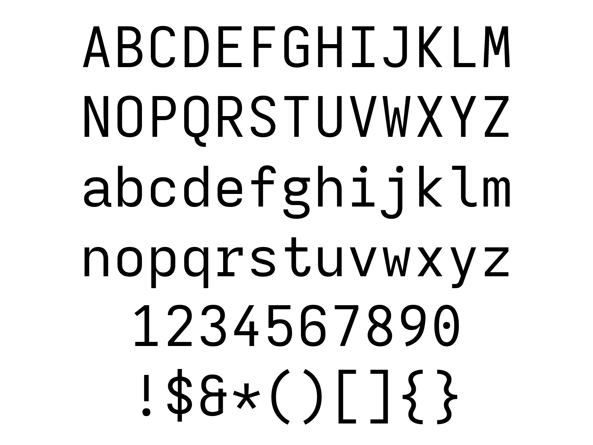
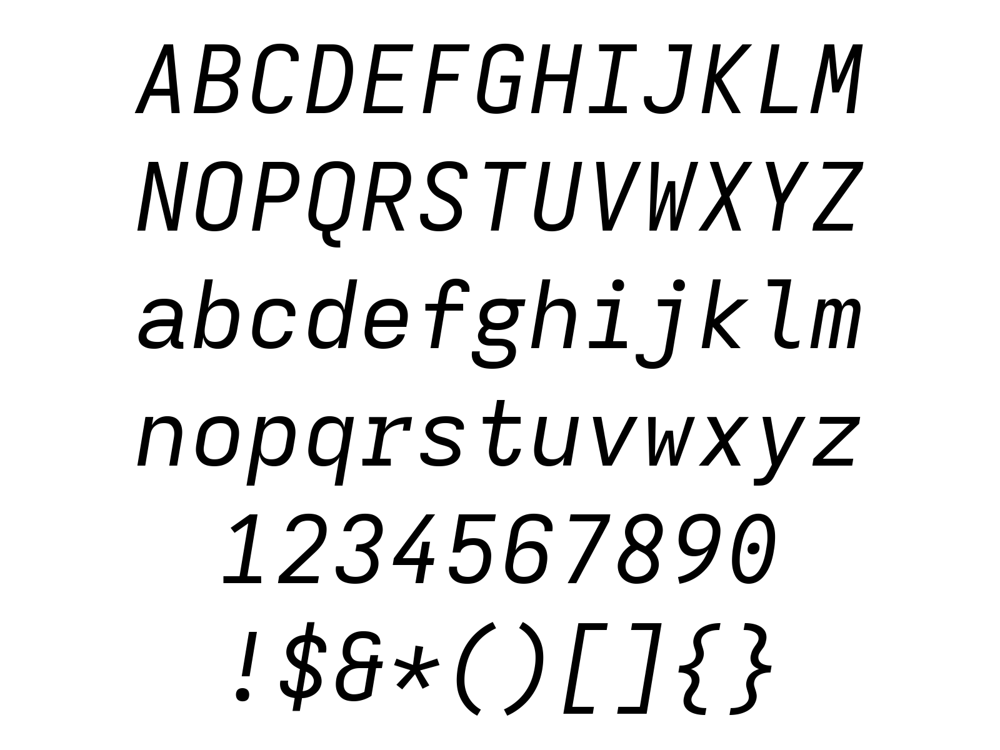

# Firosevka Font

 font with:
- Fixed width (and no ligatures)
- Fira Mono patch
- Extended spacing as default and only spacing available
- Oblique used as Italic
- Medium as Regular weight

Installation: `makepkg -si`

## Font Variants

### Regular

### Bold

### Italic

### Bold Italic

